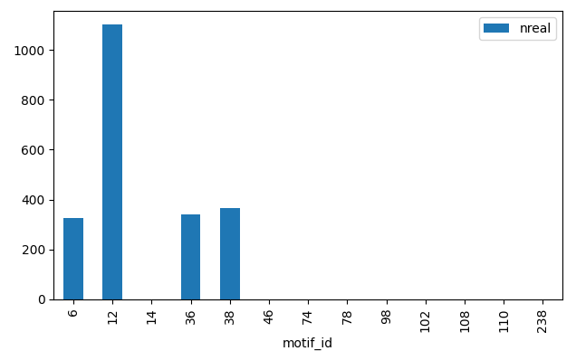
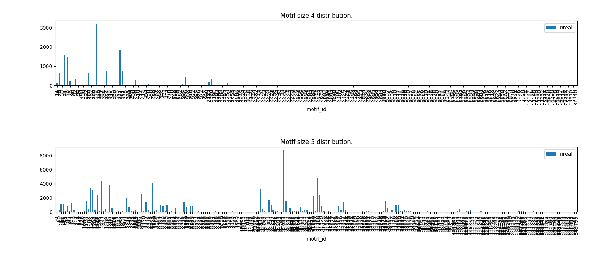
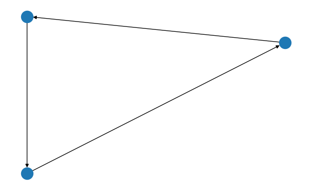

=================
Detailed Examples
=================

The source code in the following code examples can be copied right from this page by looking for the clipboard
image at the top right-hand corner of the source code box.

Basic Use
=========

* The following example is functional with all counters currently supported by ``PyMotifCounter``.

* To try out another counter, exchange ``PyMotifCounterMfinder`` for one of
  ``PyMotifCounterNetMODE, PyMotifCounterFanmod``

.. literalinclude:: resources/code_examples/basic_usage.py
    :language: Python

    Distribution of fully connected motifs of size 3 for a given network.

Parameter values and aliases
============================

* To change a parameter value, address it by its name, just as it would appear in the command line.
* Different authors are using different variable names to refer to the same entity. For example, *motif
  size* might be known as ``s`` in one algorithm but ``k`` in another. ``PyMotifCounter`` has *Parameter Aliases*
  so you can simply use ``motif_size`` and it will be translated to whatever the underlying algorithm uses.
* Let's visualise the motif distribution of size 4 and 5 motifs here:

.. literalinclude:: resources/code_examples/params_and_aliases.py
    :language: Python

    Motif distributions for motifs of size 4 and size 5.

Visualising motifs
==================

* Motif IDs translate to the adjacency matrix of the subgraph they describe.
* ``PyMotifCounter`` contains a function that can return that adjacency matrix for any further use.
* One of those uses might be to actually visualise the motif subgraph. Let's do that here:
* For more motif subgraphs, see `this motif dictionary <https://www.weizmann.ac.il/mcb/UriAlon/sites/mcb.UriAlon/files/uploads/NetworkMotifsSW/mfinder/motifdictionary.pdf>`_ [#]_

.. literalinclude:: resources/code_examples/vis_motifs.py
    :language: Python

    Motif 98, from the class of fully connected motifs of size 3 is a directed 3-cycle.

.. _ex_write_input:

Creating input files
====================

* If you have a large number of networks available, you can still use ``PyMotifCounter`` components
  to save them to disk.

* Suppose for instance that you have a number of networks that were generated by some algorithm
  or were instantiated into ``neworkx`` objects via
  `one of the formats that networkx supports <https://networkx.org/documentation/stable/reference/convert.html>`_.

* To prepare a directory of input files for data processing with one of the supported motif counters
  (e.g. ``PyMotifCounterMfinder``), you could:

.. literalinclude:: resources/code_examples/write_input_files.py
    :language: Python

Parsing existing motif counts
=============================

* If you have a directory full of output files from one of the binaries
  supported by ``PyMotifCounter``, you can still get the enumerations as
  ``pandas`` data frames.

* In this example, it is assumed that ``mfinder`` has been executed over the files
  produced by :ref:`this example <ex_write_input>`. You can do this manually, or by
  using a very simple bash script like:
  ::
    #!/bin/bash

    # A very simple bash script to apply mfinder over a
    # population of network files in a directory

    for a_file in `ls net_data_*`; do
        mfinder $a_file -s 3 -r 0 -f ${a_file}_motif_count
    done

* To parse and visualise the results, using ``PyMotifCounter`` components:

.. literalinclude:: resources/code_examples/read_output_files.py
    :language: Python

.. [#] Motif dictionary linked from the `Uri Alon Lab <https://www.weizmann.ac.il/mcb/UriAlon/download/network-motif-software>`_, developers
       of ``mfinder``.