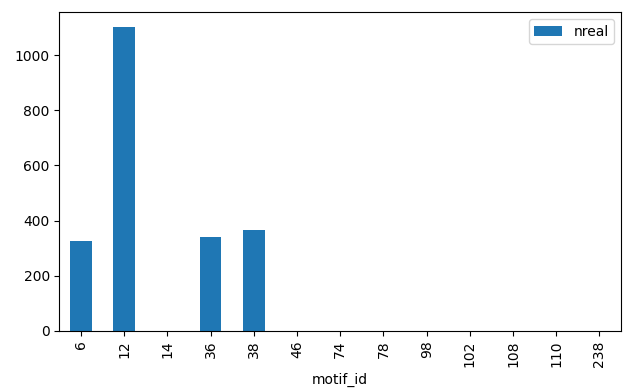

.. PyMotifCounter documentation master file, created by
   sphinx-quickstart on Wed Oct 20 13:10:29 2021.
   You can adapt this file completely to your liking, but it should at least
   contain the root `toctree` directive.

Welcome to PyMotifCounter's documentation!
==========================================

``PyMotifCounter`` is a unified interface to fast motif enumeration algorithms.

The algorithms Currently supported are:

* ``mfinder``
* ``fanmod``
* ``NetMODE``
* ``PGD``

The aim of the project is to offer a low level link to the functionality of each codebase (i.e. proper Python bindinds).

The objective of this version is to offer a python wrapping interface to external processes as if they were
Python functions.

This is achieved by abstracting the inputs, parameters and outputs of each binary, creating a high
level interface which accepts a `networkx` graph and returns a motif / graphlet distribution.

A typical usage example is as follows:

.. literalinclude:: resources/code_examples/basic_usage.py
   :language: Python

Which would produce the following distribution:

.. toctree::
   :maxdepth: 2
   :caption: Contents:

   examples
   algorithms
   motivation
   design_notes
   current_todos
   api

Indices and tables
==================

* :ref:`genindex`
* :ref:`modindex`
* :ref:`search`
